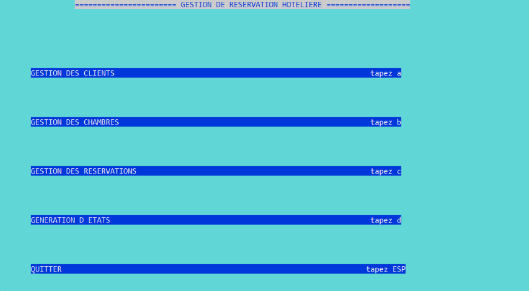

# MiniProjet

L’objectif de ce mini projet et d’appliquer les notions acquises au niveau du
cours et des Travaux pratiques effectués au Langage C. 
Ce mini projet s’intitule « Gestion des Réservations Hôtelières » qui a pour but
de développer une application en langage C qui permet aux utilisateurs
d’effectuer l’inscription des clients, la consultation, faire la mise à jour et la
suppression de leurs coordonnées, qui fait partie de la gestion clientèle, ainsi
qu’effectuer plusieurs opérations dédiées à la gestion des réservations,
chambres, et la génération des états. 

* Ci-dessous les différentes interfaces:

### Menu principale

### Gestion des clients

### Ajout 

### Consultation

### Modification 

